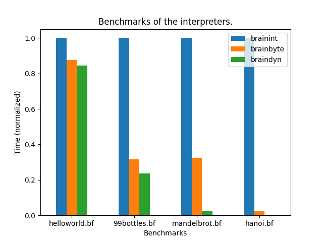

# Brainfuck

A repository to play with different brainfuck implementations.

## Motivation 

I am currently working on a jit compiler generator as my bachelor thesis so I
wanted to actually implement some jit compilers to get a feeling for it and 
brainfuck is a small enough language that it suits itself as a target.

In the future I might use this repository to benchmark the generated JIT from
my bachelor thesis and compare with other JIT libraries.

## Progress

At the moment we only have a naive interpreter and a byte code interpreter. I 
am currently researching how I can include jit libraries to compile the opcodes
to machine instructions.

## Programs



## brainint

brainint is a naive interpreter that doesn't do any code analysis etc. The only 
optimization is that it only calculates all jump targets once and caches the 
results.

## brainbyte

brainbyte is a bytecode compiler and interpreter. It archives better performance
than brainint by doing code analysis and merging multiple brainfuck instructions
into single bytecodes which reduces the overhead of interpreting the 
instructions.

Here are all the patterns it detects:
- Repeating increment/decrement instructions (`>`, `<`, `+`, `-`) are merged 
  into one opcode with an aditional byte storing the count.
- Clear loop detection `[-]`.
- Copy loop detection (something like `[->>+<<]`). Copy loops add the value of the current cell 
  to another one. In this example we add the current value to the cell two to the
  right. 
- [Simple loop](https://github.com/lifthrasiir/esotope-bfc/wiki/Comparison#simple-loop-detection)
   detection (something like `[->>+>-->>+<<<<]`). These can be optimized to 
   a series of copy or multiplication opcodes followed by a single clear 
   instruction. _Note:_ clear loops and copy loops are a special case of simple 
   loops.
- Jump instructions (`[`, `]`) store with eight bytes which store the target position 
  (this should just as effective as brainint's jump target caching).

For brainbytes OpCodes I was inspired by [this article](http://calmerthanyouare.org/2015/01/07/optimizing-brainfuck.html).

## braindyn 

braindyn is a jit compiler that uses luajit's [DynASM library](https://luajit.org/dynasm.html). It first compiles to the same bytecode as brainbyte but instead of 
executing it, it compiles the instruction into native x86 or amd64 instructions
and later executes them.

<!-- Ideas for further programs: brainbyte (a bytecode interpreter with code 
analysis), brainllvm (a jit compiler with llvm backend), brainunijit 
(a template based jit with unijit) -->

## Build it

You need the following requirements:
clang, ldd (not needed on macOS), cmake, ninja

```bash
git submodule update --init
mkdir build
cd build
cmake -G Ninja ..
ninja
```

## Usage

All interpreters/compilers can be invoked the same way, so we just show here how
to use `brainint`:

```bash
./brainint mandelbrot.bf
```

## Ressources

- [Brainfuck on esolang](https://esolangs.org/wiki/Brainfuck)
- [Brainfuck optimizations](http://calmerthanyouare.org/2015/01/07/optimizing-brainfuck.html)
- [Brainfuck optimizer in python](https://github.com/matslina/bfoptimization)
- [Some Brainfuck optimization techniques](https://github.com/lifthrasiir/esotope-bfc/wiki/Comparison)
- [DynASM unofficial tutorial](https://corsix.github.io/dynasm-doc/tutorial.html)